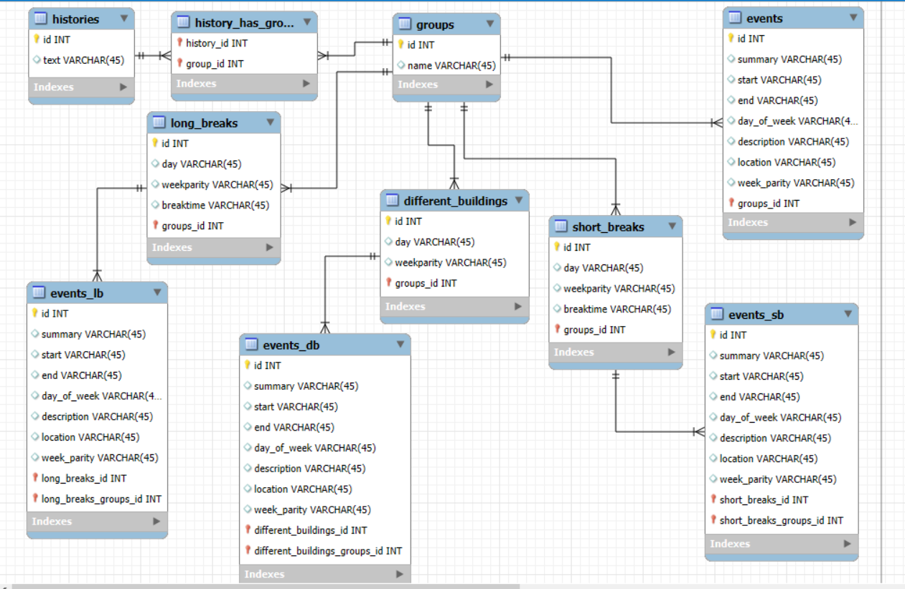

# shedule_fix

## Описание
Этот проект предоставляет приложение FastAPI для извлечения и обработки данных расписания из ссылки iCal.

Есть 3 типа узких мест в расписание:
1. different-buildings: в один день пары в разных корпусах (Например, В-78 и В-86).
2. long-breaks: в расписание есть окна.
3. short-breaks-different-campus: на короткой перемене нужно перебежать в другой кампус (Например, из И-212 в А-16)

На первом уровне нужно было разработать сам метод поиска таких мест и обернуть его в api.
На втором уровне нужно было сохранять результаты поиска "неудобств" в реляционную базу данных.
На третьем уровне нужно было реализовать следующий алгоритм:
клиент на запрос данных не ждет полной обработки, а сразу получает некий идентификатор запроса, с которым в последствии раз в разумный промежуток времени ходит в сервис. Сервис же в это время запускает на фоне выполнение этого запроса и на вопрос клиента отдает статусы этого запроса: сначала идет статус в процессе, потом уже готово, с самим ответом.

В качестве ЯП был выбран Python. В качестве основного фреймворка FastAPI. СУБД Postgre.

## Установка
1. Склонируйте репозиторий.
2. Установите пакеты:
   ```sh
   pip install -r requirements.txt
   
3. Запустите сервер:

Через контейнеры:

```shell
    docker-compose up --build
```

Локально:

```shell
    docker-compose up --build db # чтобы поднять БД
    uvicorn app.main:app --reload
```
## Функционал:

### Level 1

1. Получить полную информацию о расписании групп. Принимает необязательный параметр query.
```shell
GET http://localhost:8000/schedule_1
```
Пример запроса:
```shell
GET http://localhost:8000/schedule_1?query=ИКБО-16
```
Этот запрос выведет подробную информацию о группах ИКБО-16-21, ИКБО-16-22 и т.д.

2. Получить информацию о первом типе неудобств для групп (different-buildings). Принимает необязательный параметр query.
```shell
GET http://localhost:8000/different-buildings_1
```
Пример запроса:
```shell
GET http://localhost:8000/different-buildings_1?query=ИКБО-16
```
Этот запрос выведет информацию о первом типе неудобств для групп ИКБО-16-21, ИКБО-16-22 и т.д.

3. Получить информацию о втором типе неудобств для групп (long-breaks). Принимает необязательный параметр query.
```shell
GET http://localhost:8000/long-breaks_1
```
Пример запроса:
```shell
GET http://localhost:8000/long-breaks_1?query=ИКБО-16
```
Этот запрос выведет информацию о втором типе неудобств для групп ИКБО-16-21, ИКБО-16-22 и т.д.

4. Получить информацию о третьем типе неудобств для групп (short-breaks-different-campus). Принимает необязательный параметр query.
```shell
GET http://localhost:8000/short-breaks-different-campus_1
```
Пример запроса:
```shell
GET http://localhost:8000/short-breaks-different-campus_1?query=ИКБО-16
```
Этот запрос выведет информацию о третьем типе неудобств для групп ИКБО-16-21, ИКБО-16-22 и т.д.


### Level 2

На втором уровне была спроектирована БД:



Данная БД находится хотя бы в 1 НФ.
1. Получить полную информацию о расписании групп. Принимает необязательный параметр query.
Если ранее запрашивался такой запрос, то данные берутся из БД, иначе обращаемся к внешнему API.
```shell
GET http://localhost:8000/schedule_2
```
Пример запроса:
```shell
GET http://localhost:8000/schedule_2?query=ИКБО-16
```
Этот запрос выведет подробную информацию о группах ИКБО-16-21, ИКБО-16-22 и т.д.

2. Получить информацию о первом типе неудобств для групп (different-buildings). Принимает необязательный параметр query. 
Если ранее запрашивался такой запрос, то данные берутся из БД, иначе обращаемся к внешнему API.
```shell
GET http://localhost:8000/different-buildings_2
```
Пример запроса:
```shell
GET http://localhost:8000/different-buildings_2?query=ИКБО-16
```
Этот запрос выведет информацию о первом типе неудобств для групп ИКБО-16-21, ИКБО-16-22 и т.д.

3. Получить информацию о втором типе неудобств для групп (long-breaks). Принимает необязательный параметр query.
Если ранее запрашивался такой запрос, то данные берутся из БД, иначе обращаемся к внешнему API.
```shell
GET http://localhost:8000/long-breaks_2
```
Пример запроса:
```shell
GET http://localhost:8000/long-breaks_2?query=ИКБО-16
```
Этот запрос выведет информацию о втором типе неудобств для групп ИКБО-16-21, ИКБО-16-22 и т.д.

4. Получить информацию о третьем типе неудобств для групп (short-breaks-different-campus). Принимает необязательный параметр query.
Если ранее запрашивался такой запрос, то данные берутся из БД, иначе обращаемся к внешнему API.
```shell
GET http://localhost:8000/short-breaks-different-campus_2
```
Пример запроса:
```shell
GET http://localhost:8000/short-breaks-different-campus_2?query=ИКБО-16
```
Этот запрос выведет информацию о третьем типе неудобств для групп ИКБО-16-21, ИКБО-16-22 и т.д.


### Level 3

Несколько людей одновременно могут отправлять запросы к API. 
В ответ они получают id запроса, по которому могут отслеживать статус запроса (ручка status).

1. Получить полную информацию о расписании групп. В этот раз query указывается в теле запроса.
```shell
POST http://localhost:8000/schedule_2
```
Пример запроса:
```shell
POST http://localhost:8000/schedule_2
{
    "query": "ИКБО-16"
}
```
Этот запрос выведет подробную информацию о группах ИКБО-16-21, ИКБО-16-22 и т.д.

2. Получить информацию о первом типе неудобств для групп (different-buildings). В этот раз query указывается в теле запроса.
```shell
POST http://localhost:8000/different-buildings_2
```
Пример запроса:
```shell
POST http://localhost:8000/different-buildings_2
{
    "query": "ИКБО-16"
}
```
Этот запрос выведет информацию о первом типе неудобств для групп ИКБО-16-21, ИКБО-16-22 и т.д.

3. Получить информацию о втором типе неудобств для групп (long-breaks). В этот раз query указывается в теле запроса.
```shell
POST http://localhost:8000/long-breaks_2
```
Пример запроса:
```shell
POST http://localhost:8000/long-breaks_2
{
    "query": "ИКБО-16"
}
```
Этот запрос выведет информацию о втором типе неудобств для групп ИКБО-16-21, ИКБО-16-22 и т.д.

4. Получить информацию о третьем типе неудобств для групп (short-breaks-different-campus). В этот раз query указывается в теле запроса.
```shell
POST http://localhost:8000/short-breaks-different-campus_2
```
Пример запроса:
```shell
POST http://localhost:8000/short-breaks-different-campus_2
{
    "query": "ИКБО-16"
}
```
Этот запрос выведет информацию о третьем типе неудобств для групп ИКБО-16-21, ИКБО-16-22 и т.д.

5. Получить статус запроса (status):

Пример запроса:
```shell
GET http://localhost:8000/status/2
```